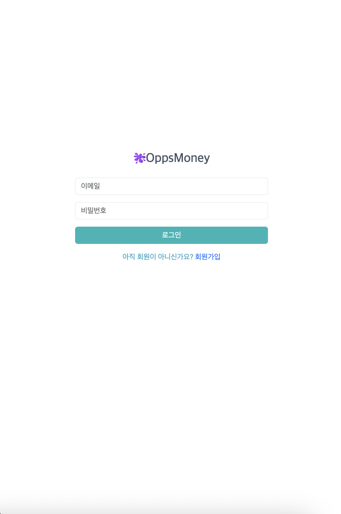
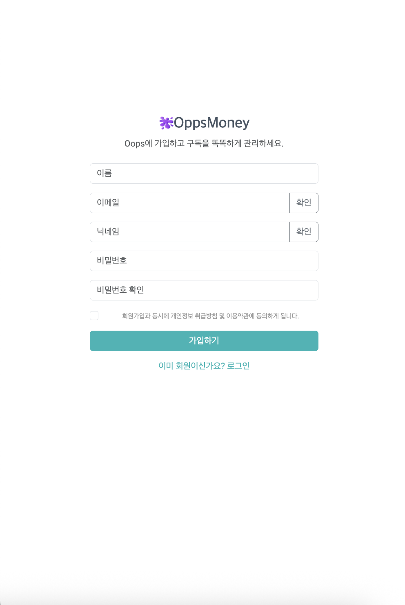
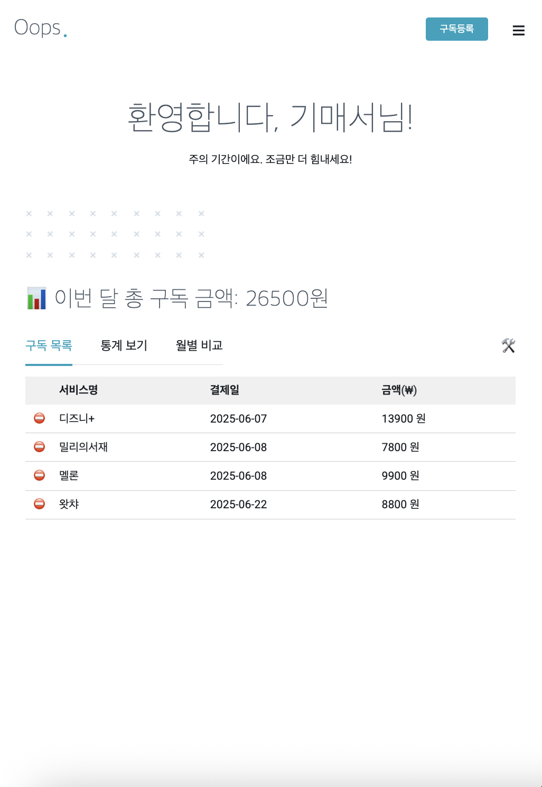
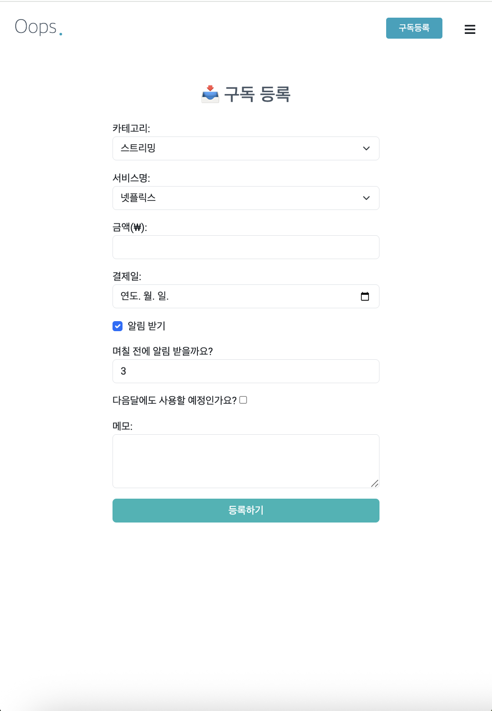
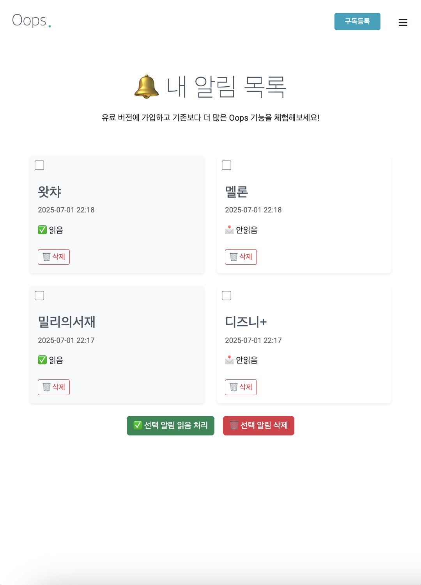
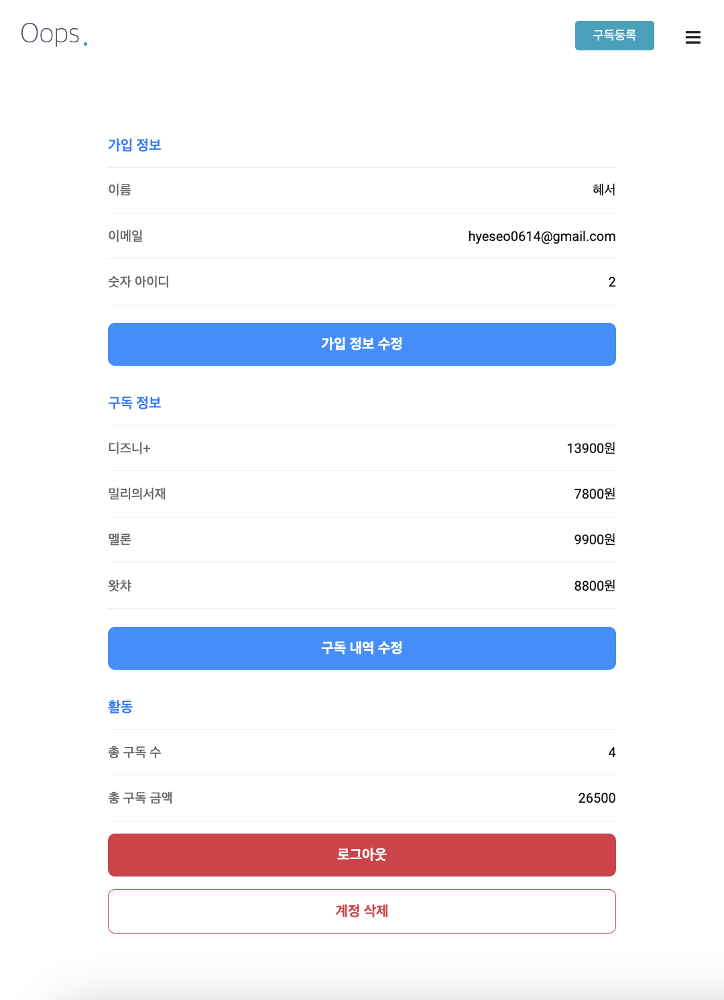

# 🫟Oppsmoney

Spring Boot 기반의 **유료 구독 알림 시스템** 입니다.
사용자의 유료 구독 내역을 등록하고, 매월 자동 알림을 통해 구독 관리를 돕는 실용적인 포트폴리오 프로젝트입니다.
사용자가 등록한 구독 서비스에 대해 **알림 스케줄링**, **읽음 처리**, **삭제**, **미확인 알림 카운트** 등의 기능을 제공합니다.

---

## 💡 주요 기능

### 👤 회원 기능
- 회원가입/ 로그인
- 마이페이지
  - 가입정보 수정
  - 구독 수정
  - 로그아웃
  - 계정 삭제

### 💳 구독관리
- 구독 등록 (카테고리, 서비스명, 금액, 결제일, 알림일 및 알림 여부, 메모 등 입력)
- 구독 목록 보기 (로그인 후 확인 가능)
- 통계 보기 (이번달/지번달 비교)
- 월별 비교 (차트로 시각화)

### 🔔 알림 기능
- 매월 결제일 전 사용자에게 자동 알림 전송 (Spirng Scheduler)
- 알림 목록 확인
- 알림 읽음 처리 /  삭제
- 미확인 알림 표시

### 🛠️ 고객 지원 (Q&A)
- 사용자 Q&A 작성
- 관리자 로그인 시 답변 가능 (관리자 전용 페이지 제공)

### 🤝 협업 제안
- 협업 제안 작성 -> 관리자 이메일로 전송

---

### 기능 흐름도
[회원가입] -> [로그인] -> [구독 등록] -> [대시보드 확인] -> [자동 알림 수신]
                                         ↘ [통계 보기] ↘ [Q&A / 협업 제안]

                                         

---

## 🖼️ 주요 화면 구성

### 로그인 / 회원가입 페이지



### 대시보드 (구독 목록 + 통계 카드 + 알림 표시)


### 구독 등록 폼 (카테고리, 금액, 주기, 메모 입력)


### 알림 페이지 (체크박스로 읽음/삭제 다중 선택 기능)


### 마이페이지 (회원정보 수정, 구독 수정, 계정 삭제)


### Q&A 게시판 (사용자 Q -> 관리자 A)


- 협업 제안 폼

---

## 🛠️ 기술 스택

|         영역        |                                                    |
|--------------------|----------------------------------------------------|
|      Language      |  Java 17                                           |
|      Framework     |  Spring Boot 3x, Spring MVC, Spring Data JPA       |
|       View         |  Thymeleaf, Bootstrap 5                            |
|       DB           |  MySQL 8.x                                         |
|       ORM          |  Hibernate (JPA 기반)                               |
|      Build Tool    |  Gradle                                            |
|       기타          |  Lombok, JSTL, Spring Scheduler                    |


---

## 프로젝트 폴더 구조

````
subscribe/
├─ src/main/java/com/example/subscribe/
│ ├─ controller/ # 웹 요청 처리
│ ├─ service/ # 비즈니스 로직
│ ├─ repository/ # DB 접근
│ ├─ dto/ # 데이터 전송 객체
│ └─ entity/ # JPA 엔티티
│
├─ src/main/resources/
│ ├─ templates/
│ │ ├─ dashboard.html
│ │ ├─ login.html
│ │ ├─ user-register.html
│ │ ├─ mypage.html
│ │ ├─ mypage-edit.html
│ │ ├─ subscription-register.html
│ │ ├─ subscription-edit.html
│ │ ├─ notification-list.html
│ │ ├─ support.html
│ │ ├─ collaboration.html
│ │ ├─ admin-dashboard.html
│ │ ├─ admin-unanswered.html
│ │ ├─ admin-proposal-list.html
│ │ └─ fragments/
│ │ ├─ head.html
│ │ ├─ footer.html
│ │ └─ sidebar.html
│ └─ application.properties
│
├─ build.gradle
└─ README.md
````

---

## 실행 방법

### 1.DB 연결 설정

`src/main/resources/application.properties` 파일에서 MySQL 연결 정보 설정:
```properties
spring.datasource.url=jdbc:mysql://localhost:3306/subscription_db?serverTimezone=Asia/Seoul
spring.datasource.username=root
spring.datasource.password=12345678
spring.jpa.hibernate.ddl-auto=update
```

### 2. Gradle 빌드 및 서버 실행

```bash
./gradlew bootRun
```

## 3. 브라우저에서 접속
http://localhost:8080

---

## 🔐 테스트 계정

- ***사용자***
ID : hyeseo0614@gmail.com / PW : Kimhyeseo06!

- ***관리자***
ID : oppsmoney.manager@gmail.com / PW : Qwer123!@#

---

## 👨‍💻개발자 정보

- 김혜서
- GitHub : [@hyeseo-kim] (https://github.com/hyeseo-kim)
- Email : hyeseo0614@gmail.com


---

### 🚀 데모 주소
- 현재는 로컬 전용 / 추후 배포 예정

---

### 🛠️ 트러블 슈팅 / 개선사항
- 알림을 매일 전체 사용자에게 보내면 부하가 큼 -> 구독자 별 필터링하려 대상만 추출
- 알림 중복 전송 방지 : 날짜 기준으로 이미 전송된 알림은 제외
- 다중 알림 처리 -> JS에서 체크박스로 선택 후 `/read-many`, `/delete-many` 구현

---

### 📝 README 적용 방법
```bash
git add README.md
git commit -m "README 작성 완료"
git push origin main
```
